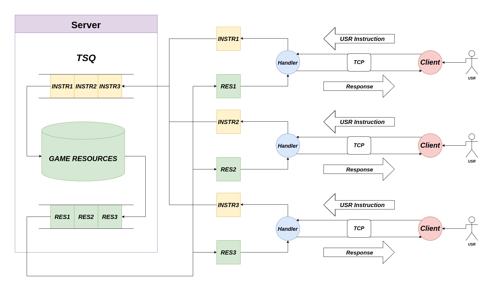

# Documentación Técnica
## Arquitectura

El programa se basa en un modelo de comunicación **Cliente-Servidor** mediante un protocolo **TCP**. El programa **Servidor** contiene y administra los recursos del juego y maneja la comunicación con los clientes. 
Cada **Cliente** es un programa encargado de transmitir los eventos del mouse y teclado del **Usuario**. Del lado del Servidor se encuentra una clase *manejadora* que se encarga de convertir estos eventos en instrucciones concretas para el servidor. Estas instrucciones son almacenadas en una **Thread Safe Queue** que al llenarse pasa a ser recorrida secuencialmente, ejecutandose cada instrucción sobre los recursos del juego para actualizar su estado. 
Para cada **Instrucción** el Servidor produce una **Respuesta**. Esta incluye por un lado información específica para cada cliente en función de la instrucción enviada y por el otro información sobre el estado actual del juego que será la misma para cada cliente.

Para la Interfaz de usuario se utilizaron los frameworks **Qt** y **SDL2** (en particular, la librería de wrappers C++ **SDL2pp**). El programa Cliente solo se encarga de procesar eventos del mouse y teclado y de recibir la respuesta del Servidor a partir de la cual produce las vistas en pantalla para el Usuario. Se busco de esta forma lograr una adecuada separación de responsabilidades, donde toda la lógica de manejo de los recursos del juego quede encapsulada del lado del Servidor mientras que el manejo de Qt y SDL2 queda encapsulado del lado del Cliente.